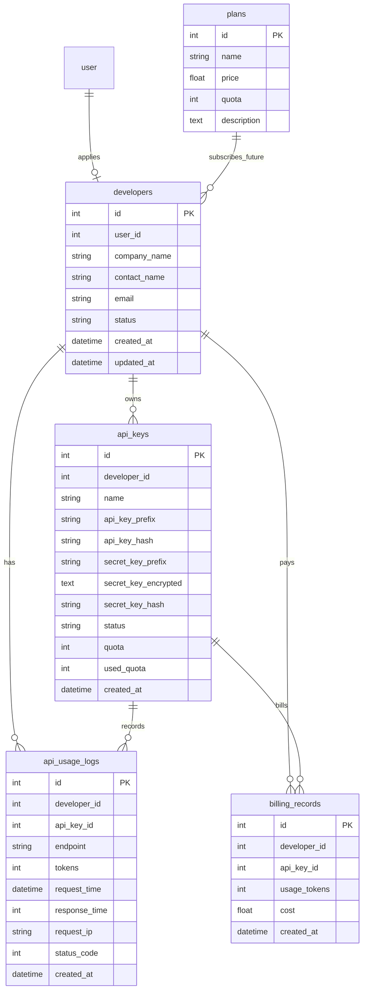

# AIName B端开放平台设计说明

## 新增数据库表

- `developers`: 开发者申请与审核状态。
- `api_keys`: API Key 元数据、哈希、Secret 加密值、额度。
- `api_usage_logs`: 开放 API 调用日志、耗时、Token、IP、状态码。
- `billing_records`: 按 Token 产生的计费流水，后续可关联支付订单。
- `plans`: 套餐表，支持免费版、专业版、企业版。

## 新增后端文件

- `core/api_key.py`: API Key 生成、HMAC 哈希、Secret 加密。
- `models/developer.py`: 开放平台 ORM 模型。
- `schemas/developer.py`: 开发者、Key、开放 API 请求响应模型。
- `repository/developer_repo.py`: 开发者与 Key 数据访问。
- `routers/developer.py`: 开发者中心接口。
- `routers/openapi.py`: B 端开放 API。
- `routers/admin_open_platform.py`: 管理员开放平台管理接口。
- `alembictable/versions/3f4a2c1d9b80_add_open_platform.py`: 数据库迁移。

## 新增前端页面

- `pages/developer/index.vue`: 开发者申请、Dashboard、API Key 管理。
- `pages/developer/logs.vue`: 调用记录、耗时、Token、费用。

## API Key 设计方案

- API Key 只在创建时返回一次，格式为 `ak_xxx`。
- 数据库不保存明文 API Key，只保存 `api_key_prefix` 与 `api_key_hash`。
- `api_key_hash = HMAC-SHA256(JWT_SECRET_KEY, api_key)`，用于 Bearer Token 校验。
- Secret Key 只在创建时返回一次，格式为 `sk_xxx`。
- 数据库存储 `secret_key_encrypted` 和 `secret_key_hash`，后续接入 SDK 签名时可扩展校验。

## 鉴权方案

开放 API 使用：

```http
Authorization: Bearer ak_xxxxxxxxx
```

服务端流程：

1. 读取 Bearer Token。
2. 使用 `JWT_SECRET_KEY` 计算 HMAC。
3. 查询 `api_keys.api_key_hash`。
4. 校验 `status = active`。
5. 校验 `used_quota < quota`。
6. 调用 AI 命名引擎。
7. 写入调用日志、计费流水并累加 `used_quota`。

## 调用统计方案

每次请求写入 `api_usage_logs`：

- `developer_id`
- `api_key_id`
- `endpoint`
- `tokens`
- `request_time`
- `response_time`
- `request_ip`
- `status_code`
- `created_at`

开发者 Dashboard 聚合：

- API Key 数量
- 今日调用次数
- 累计调用次数
- 累计 Token 消耗
- 本月费用

## 计费方案

当前实现先落地两类计费基础：

- 按调用次数：`api_keys.quota` 与 `used_quota` 控制套餐额度。
- 按 Token：`billing_records.usage_tokens` 与 `cost` 记录每次消耗。

预留支付扩展：

- 后续可新增 `payment_orders` 表，字段包含 `provider`、`provider_trade_no`、`amount`、`status`。
- 支付宝/微信支付回调成功后更新订单并增加套餐额度。
- SaaS 商业化可在 `plans` 上继续扩展周期、席位、并发、专属模型等字段。

## 数据库 ER 图



## 开放 API 列表

| 接口 | 场景 | 请求 |
| --- | --- | --- |
| `POST /openapi/npc-name` | 游戏 NPC 命名 | `race`, `gender`, `style` |
| `POST /openapi/novel-character` | 小说角色命名 | `novel_type`, `gender` |
| `POST /openapi/location-name` | 小说地名/组织名 | `style` |
| `POST /openapi/baby-name` | 宝宝起名 | `surname`, `gender` |
| `POST /openapi/company-name` | 企业品牌命名 | `industry`, `style` |

## Swagger 示例

FastAPI 启动后访问：

```text
http://127.0.0.1:8000/docs
```

请求示例：

```bash
curl -X POST "http://127.0.0.1:8000/openapi/npc-name" \
  -H "Authorization: Bearer ak_xxxxxxxxx" \
  -H "Content-Type: application/json" \
  -d "{\"race\":\"人类\",\"gender\":\"男\",\"style\":\"东方玄幻\"}"
```

响应示例：

```json
{
  "name": "叶长歌",
  "meaning": "长歌寄志，适合东方玄幻风格角色。",
  "tokens": 42
}
```

## SDK 示例

Python:

```python
import requests

resp = requests.post(
    "http://127.0.0.1:8000/openapi/company-name",
    headers={"Authorization": "Bearer ak_xxxxxxxxx"},
    json={"industry": "AI", "style": "科技感"},
    timeout=60,
)
print(resp.json())
```

NodeJS:

```javascript
const resp = await fetch("http://127.0.0.1:8000/openapi/baby-name", {
  method: "POST",
  headers: {
    "Authorization": "Bearer ak_xxxxxxxxx",
    "Content-Type": "application/json"
  },
  body: JSON.stringify({ surname: "王", gender: "男" })
});

console.log(await resp.json());
```

Java:

```java
HttpRequest request = HttpRequest.newBuilder()
    .uri(URI.create("http://127.0.0.1:8000/openapi/location-name"))
    .header("Authorization", "Bearer ak_xxxxxxxxx")
    .header("Content-Type", "application/json")
    .POST(HttpRequest.BodyPublishers.ofString("{\"style\":\"修仙宗门\"}"))
    .build();

HttpResponse<String> response = HttpClient.newHttpClient()
    .send(request, HttpResponse.BodyHandlers.ofString());
System.out.println(response.body());
```

## 如何部署和测试

1. 配置 `.env`：`DB_URI`、`JWT_SECRET_KEY`、`DEEPSEEK_API_KEY`。
2. 执行迁移：`alembic upgrade head`。
3. 启动后端：`uvicorn main:app --reload`。
4. 登录普通用户并调用 `POST /developer/apply`。
5. 管理员调用 `PUT /admin/developers/{developer_id}/approve` 审核通过。
6. 开发者调用 `POST /developer/api-keys` 创建 Key。
7. 使用 `Authorization: Bearer API_KEY` 调用 `/openapi/*`。
8. 查看 `/developer/dashboard` 与 `/developer/logs` 验证统计和计费。
